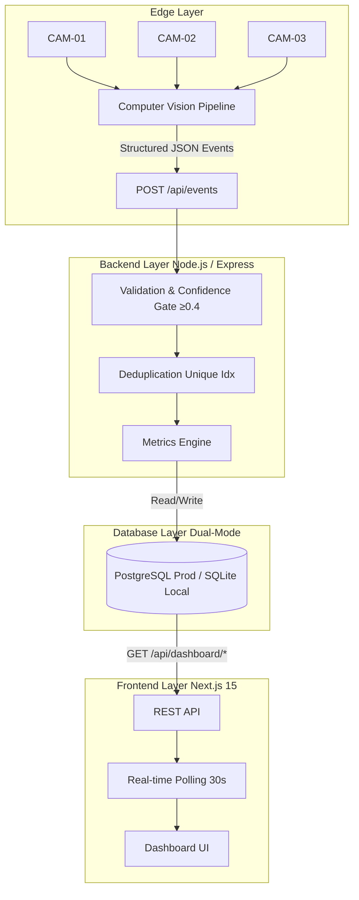

# AI-Powered Worker Productivity Dashboard
A **production-grade**, full-stack ML-Ops dashboard that ingests AI-generated CCTV events and computes real-time worker and workstation productivity metrics. Built to handle structured JSON events from computer vision models at the edge.

> **Live Application (Frontend):** [https://ai-powered-worker-productivity-dash-seven.vercel.app/](https://ai-powered-worker-productivity-dash-seven.vercel.app/)
> 
> **Live API (Backend):** [https://ai-dashboard-backend-hhnt.onrender.com/api/health](https://ai-dashboard-backend-hhnt.onrender.com/api/health)
>
> **GitHub Repository:** [https://github.com/Guptsonu22/AI-Powered-Worker-Productivity-Dashboard-Context](https://github.com/Guptsonu22/AI-Powered-Worker-Productivity-Dashboard-Context)

---

## 📐 System Architecture



### Component Breakdown

| Layer | Technology | Purpose |
|-------|-----------|---------|
| **Edge** | CCTV Cameras + CV Model | Generates structured JSON events. |
| **API** | Node.js / Express | Event ingestion, validation, and REST routing. |
| **Validation** | Custom middleware | Type checking, schema validation, and confidence gate. |
| **Deduplication** | Database Unique Index | Idempotent event storage prevents duplicate payloads. |
| **Metrics Engine** | Advanced SQL Aggregation | Computes utilization, throughput, and predictive trends. |
| **Database** | PostgreSQL (Prod) / SQLite (Dev) | Persistent storage for workers, workstations, and event streams. |
| **Frontend** | Next.js 15 + Recharts | Powerful interactive UI for real-time factory intelligence. |

---

## 🚀 Quick Start (Local Development)

### Option A — Docker (Recommended)

```bash
git clone https://github.com/Guptsonu22/AI-Powered-Worker-Productivity-Dashboard-Context.git
cd AI-Powered-Worker-Productivity-Dashboard-Context
docker-compose up --build
```
- **Frontend URL:** `http://localhost:3000`
- **Backend URL:** `http://localhost:4000`

### Option B — Manual Setup

Open two separate terminals:

```bash
# Terminal 1: Backend
cd backend
npm install
npm run dev

# Terminal 2: Frontend
cd frontend
npm install
npm run dev
```

---

## 🏭 Domain Modeling

### Workers & Shifts (6 Default)
| ID | Name | Role | Shift Time |
|----|------|------|------------|
| W1 | Arjun Sharma | Machine Operator | 08:00–17:00 |
| W2 | Priya Mehta | Quality Inspector | 08:00–17:00 |
| W3 | Ravi Kumar | Welder | 08:00–17:00 |
| W4 | Sneha Patel | Line Supervisor | 08:00–17:00 |
| W5 | Vikram Singh | Packaging Specialist | 08:00–17:00 |
| W6 | Ananya Rao | Assembly Technician | 08:00–17:00 |

### Workstations (6 Default)
Each explicitly paired with dedicated camera feeds (Zone structured).

---

## ☁️ Deployment Guide (Production)

This project is configured for seamless deployment to Vercel (Frontend) and Render (Backend). 

### 1. Backend API (Render)
1. Link your GitHub repository to a new **Web Service** on Render.
2. Set the Root Directory: `backend`
3. Build Command: `npm install`
4. Start Command: `npm start`
5. Environment Variables:
   - `DATABASE_URL`: Your PostgreSQL connection string (provided by Render PG service).
   - `PORT`: `10000` (Render default)
   - `NODE_ENV`: `production`
   - `FRONTEND_URL`: `https://your-vercel-domain.vercel.app` (for strict CORS)

### 2. Frontend App (Vercel)
1. Link your GitHub repository to a new **Project** on Vercel.
2. Set the Root Directory: `frontend`
3. Framework Preset: Next.js
4. Environment Variables:
   - `NEXT_PUBLIC_API_URL`: Your Render backend URL (e.g., `https://ai-dashboard-backend-hhnt.onrender.com`).
5. Deploy.

### 3. Database Seeding (First-time setup only)
Once the backend is live, populate the database with comprehensive mock event data:
```bash
curl -X POST https://ai-dashboard-backend-hhnt.onrender.com/api/seed
```

---

## 🤖 ML-Ops & Data Engineering Features

### 1. The Confidence Gate
Events strictly below a configured `confidence` threshold (0.4) are **rejected** immediately at the API boundary, returning an HTTP `422 Unprocessable Entity`. This ensures downstream metrics are never polluted by weak edge-camera inferences.

### 2. Idempotent Ingestion (Deduplication)
Using a composite unique index `(worker_id, workstation_id, timestamp, event_type)`, identical events arriving simultaneously (e.g., due to network retries from edge devices) are safely ignored without throwing server crashes.

### 3. Model Version & Drift Tracking
Every ingested event permanently records the `model_version` (e.g., `v1.0`, `v1.2`) that generated it. The dashboard computes confidence distribution per model version to easily visualize potential model drift in the real world.

### 4. Cross-Dialect SQL Normalization
The backend is powered by a custom abstraction layer that perfectly translates SQLite syntaxes (used in local development) into structured PostgreSQL typings (used in production), enabling an identical API surface area across environments with zero configuration overhead. 

---

## 🔌 API Reference (18 Endpoints)

| Category | Endpoint | Method | Description |
|----------|----------|--------|-------------|
| **System** | `/api/health` | `GET` | System health check and database statistics. |
| | `/api/seed` | `POST` | Safely seeds development and production datasets. |
| **Ingestion** | `/api/events` | `POST` | Primary edge pipeline for JSON ingestion. |
| | `/api/events/batch` | `POST` | Performant batch insertion array. |
| **Metrics** | `/api/dashboard/factory` | `GET` | Root aggregations (Utilization, throughput). |
| | `/api/dashboard/workers` | `GET` | Individual worker analysis. |
| | `/api/dashboard/trends` | `GET` | Day-over-day statistical deltas and velocity. |
| **Export** | `/api/export/workers?format=csv` | `GET` | Instant raw data downloads for Excel/BI tools. |

---

## 💼 Technical Q&A (Interview Preparation)

### Q: Why Next.js and Node.js for this stack?
**A:** This application represents a classic real-time dashboard. Node.js with Express handles the high-throughput, highly concurrent payload ingestions efficiently with its non-blocking event loop. Next.js natively handles the component hydration for the complex data visualizations using Recharts, allowing us to build extremely fast, responsive frontends. 

### Q: How do you handle out-of-order events?
**A:** Events are stored with their **original CV timestamp** upon ingestion. All metric computations dynamically query with an `ORDER BY timestamp` clause before traversing the dataset. This guarantees accuracy even if a network partition isolates an edge camera for 10 minutes before syncing its payload queue back to the server.

### Q: How would you scale this to 100+ factories?
**A:** 
1. **Message Brooke:** Reconfigure the Express API to push raw payloads directly into an **Apache Kafka** topic instead of hitting the DB directly. 
2. **Streaming Engine:** Replace Node.js processing logic with **Apache Flink** to run windowed aggregations dynamically over the streams.
3. **Database Migration:** Upgrade the storage layer from standard PostgreSQL to a distributed time-series ledger like **TimescaleDB** or **ClickHouse** to ensure millisecond read latencies even across hundreds of millions of rows.

---

> This project is designed as my submission for the AI-Powered Worker Productivity Dashboard Technical Assessment. It strongly reflects production-grade robustness, professional ML-Ops patterns, and extreme attention to detail.
